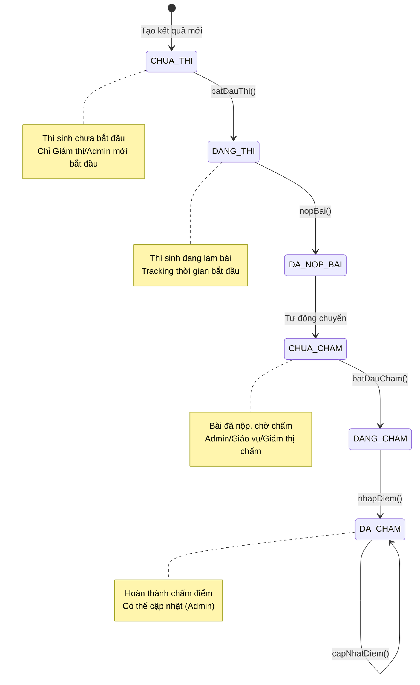
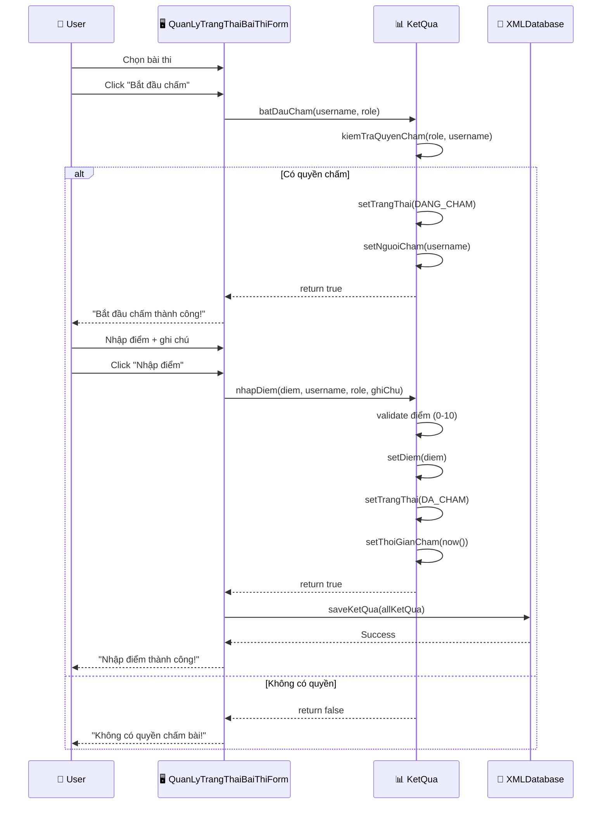
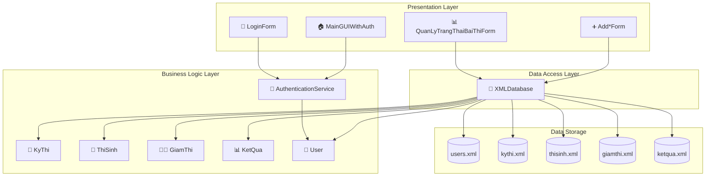
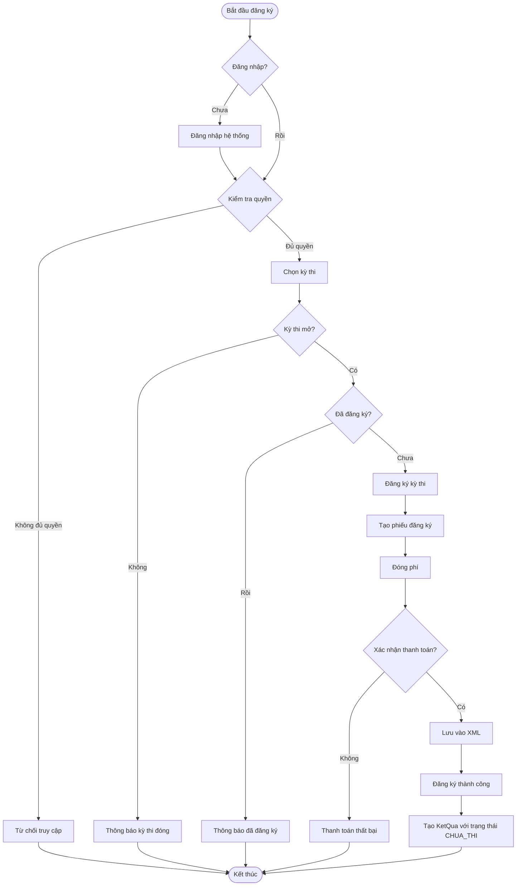

# UML Diagrams - Hệ thống Quản lý Kỳ thi

## 1. Class Diagram - Core Business Logic

```mermaid
classDiagram
    class KyThi {
        -String maKyThi
        -String tenKyThi
        -LocalDate ngayToChuc
        -String tinhTrang
        -List~ThiSinh~ danhSachThiSinh
        -List~GiamThi~ danhSachGiamThi
        -double phiDangKy
        +themThiSinh(ThiSinh): boolean
        +themGiamThi(GiamThi): boolean
        +xoaThiSinh(ThiSinh): boolean
        +kiemTraTrungLap(ThiSinh): boolean
        +tinhTongPhi(): double
    }

    class ThiSinh {
        -String maThisinh
        -String hoTen
        -LocalDate ngaySinh
        -String gioiTinh
        -String diaChi
        -String sdt
        +getAge(): int
        +validate(): boolean
        +toString(): String
    }

    class GiamThi {
        -String maGiamThi
        -String hoTen
        -String donVi
        -String sdt
        -String email
        -String username
        +phanCong(KyThi): boolean
        +toString(): String
    }

    class KetQua {
        -ThiSinh thiSinh
        -KyThi kyThi
        -double diem
        -TrangThaiBaiThi trangThai
        -String nguoiCham
        -LocalDateTime thoiGianBatDauThi
        -LocalDateTime thoiGianNopBai
        -LocalDateTime thoiGianCham
        -String ghiChu
        +batDauThi(): boolean
        +nopBai(): boolean
        +batDauCham(String, String): boolean
        +nhapDiem(double, String, String, String): boolean
        +capNhatDiem(double, String, String, String): boolean
        +getXepLoai(): String
    }

    class TrangThaiBaiThi {
        <<enumeration>>
        CHUA_THI
        DANG_THI
        DA_NOP_BAI
        CHUA_CHAM
        DANG_CHAM
        DA_CHAM
        +getMoTa(): String
    }

    class PhieuDangKy {
        -ThiSinh thiSinh
        -KyThi kyThi
        -LocalDate ngayDangKy
        -double phiDangKy
        -boolean daThanhToan
        +xacNhanThanhToan(): boolean
        +taoPhieu(): String
    }

    class User {
        -String username
        -String password
        -String hoTen
        -String email
        -String role
        -LocalDateTime lastLogin
        -boolean isActive
        +getFullName(): String
        +toString(): String
    }

    %% Relationships
    KyThi ||--o{ ThiSinh : "có nhiều"
    KyThi ||--o{ GiamThi : "được giám sát bởi"
    ThiSinh ||--o{ KetQua : "có kết quả"
    KyThi ||--o{ KetQua : "có kết quả"
    KetQua ||--|| TrangThaiBaiThi : "có trạng thái"
    ThiSinh ||--o{ PhieuDangKy : "đăng ký"
    KyThi ||--o{ PhieuDangKy : "được đăng ký"
    GiamThi ||--|| User : "liên kết với"
```

## 2. Use Case Diagram - Hệ thống phân quyền

```mermaid
graph TB
    Admin[👨‍💼 Admin]
    GiaoVu[👩‍🏫 Giáo vụ]
    GiamThi[👨‍🏫 Giám thị]
    
    subgraph "Hệ thống Quản lý Kỳ thi"
        UC1[Quản lý tài khoản]
        UC2[Tạo/sửa kỳ thi]
        UC3[Quản lý giám thị]
        UC4[Bắt đầu thi]
        UC5[Nộp bài]
        UC6[Bắt đầu chấm bài]
        UC7[Nhập điểm]
        UC8[Cập nhật điểm]
        UC9[Xem kết quả]
        UC10[Phân công giám thị]
        UC11[Quản lý trạng thái bài thi]
    end
    
    %% Admin permissions
    Admin --> UC1
    Admin --> UC2
    Admin --> UC3
    Admin --> UC4
    Admin --> UC5
    Admin --> UC6
    Admin --> UC7
    Admin --> UC8
    Admin --> UC9
    Admin --> UC10
    Admin --> UC11
    
    %% Giáo vụ permissions
    GiaoVu --> UC2
    GiaoVu --> UC3
    GiaoVu --> UC6
    GiaoVu --> UC7
    GiaoVu --> UC8
    GiaoVu --> UC9
    GiaoVu --> UC10
    GiaoVu --> UC11
    
    %% Giám thị permissions
    GiamThi --> UC4
    GiamThi --> UC5
    GiamThi --> UC6
    GiamThi --> UC7
    GiamThi --> UC9
    GiamThi --> UC11
```



## 3. State Diagram - Trạng thái Bài thi



## 4. Sequence Diagram - Quy trình Nhập điểm



## 5. Component Diagram - Kiến trúc hệ thống



## 6. Activity Diagram - Quy trình Đăng ký Thi



## 🎯 Mô tả UML Diagrams

### 📊 **Class Diagram**
- Thể hiện các class chính và mối quan hệ giữa chúng
- Core entities: KyThi, ThiSinh, GiamThi, KetQua, User
- Enum TrangThaiBaiThi với 6 trạng thái
- Relationships: 1-to-many, composition, association

### 🎭 **Use Case Diagram**  
- Phân quyền rõ ràng theo 3 roles: Admin, Giáo vụ, Giám thị
- Admin có toàn quyền
- Giáo vụ quản lý học tập, chấm bài
- Giám thị giám sát thi, chấm bài được phân công

### 🔄 **State Diagram**
- 6 trạng thái bài thi với transitions hợp lệ
- Business rules được enforce qua state machine
- Prevent invalid state transitions

### ⏱️ **Sequence Diagram**
- Quy trình nhập điểm chi tiết
- Interaction giữa User, GUI, Business Logic, Database
- Error handling và validation flow

### 🏗️ **Component Diagram**
- Kiến trúc 3-layer: Presentation, Business, Data
- Separation of concerns rõ ràng
- XML-based data persistence

### 📋 **Activity Diagram**
- Business process đăng ký thi end-to-end
- Decision points và validation steps
- Error handling và happy path
